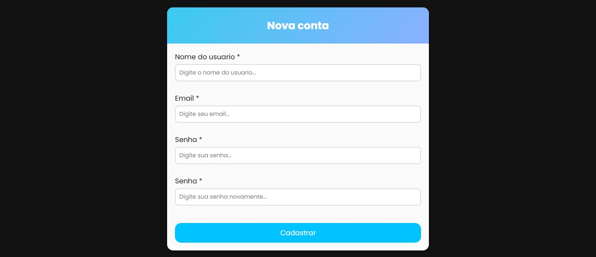

# validaForm
> Status: Developed ✅

*Desenvolvi esse formulario para estudar sobre validações*

### Informações de estudos:

- Evento blur.
- Validação de nome.
- Validação de senha.
- Validação de confirmação de senha.
- Validação se existe erro.
- Spread Operator.

### Tecnologias usadas:

- **HTML**
- **CSS**
- **JavaScript**
